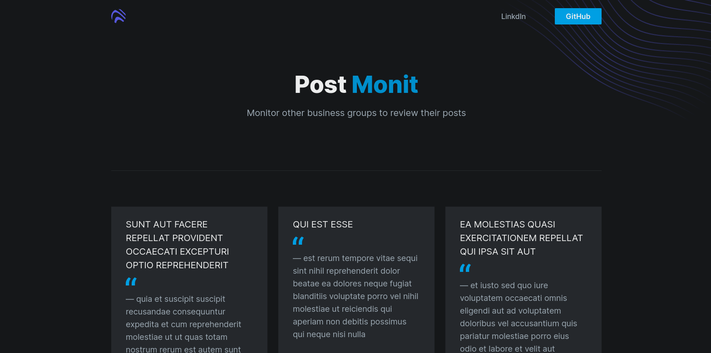

# Posts Monit

### Monitor other business groups to review their posts

## <a href="https://posts-monit.netlify.app">DEMO</a>

API:<br />
https://github.com/gabriel-cardoso-oliveira/postsmonit-server<br />

## Quick start

Install:

```
git clone https://github.com/gabriel-cardoso-oliveira/posts-monit.git
```
```
cd posts-monit/
```
```
yarn install
```

Execute:

```
yarn start
```

<p align="center">
  
</p>
